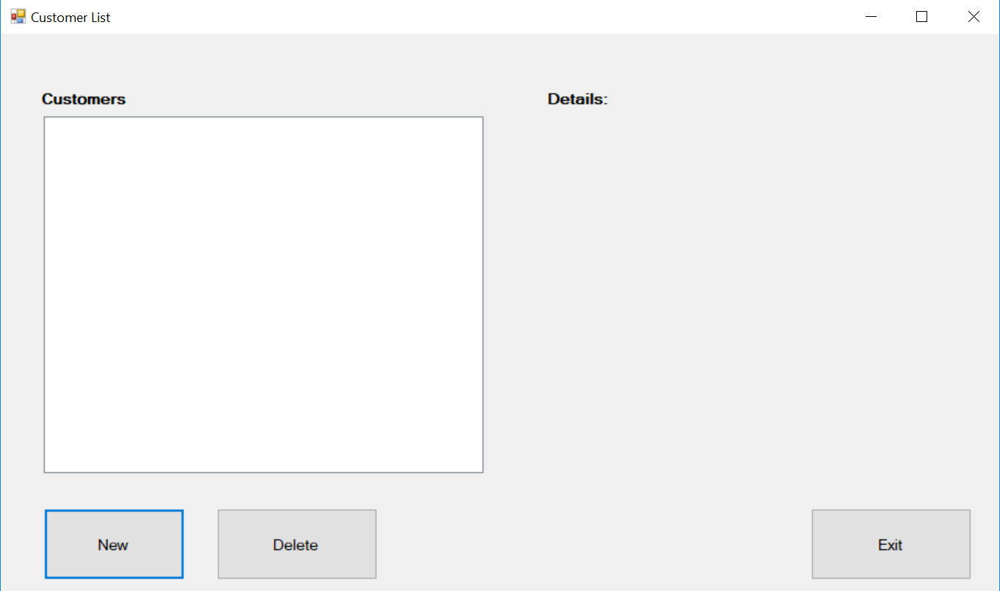
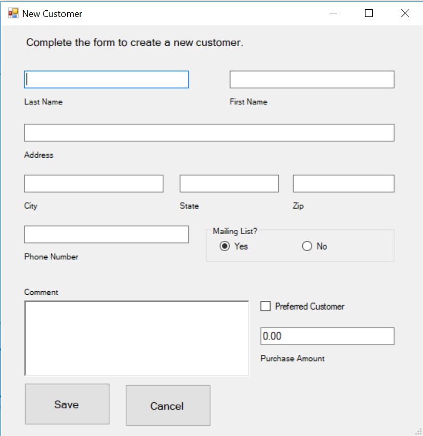

# Customer Information

Complete the following by creating the classes described below and creating a GUI application utilizing the classes. Create 2 forms for this application. You will have List of type Customer that use to keep track of all customers added.

## Forms

### Customer List

This form has 3 buttons, 2 labels and a list box.The Add button will open a new form. The Delete button should remove an element from the list. The Exit button should exit the application `Application.Exit();`
When a user clicks a customer on the list it should display the customer details. Use the `ToString()` method.

### New Customer

This form is used to collect the new customer information. If the prefered customer checkbox is checked, create a PreferredCustomer, otherwise create a Customer. This should be added to the list on the previous form.

**Hint: Make sure all your classes are public** 

## Person Class
Begin a new project named Customer Information, and design a class named Person with the following fields and properties:
- LastName (string)
- FirstName (string)
- Address (string)
- City (string)
- State (string)
- Zip (string)
- Phone (string)

Implement the properties as public property procedures. Implement the IComparable<T> interface so be able to sort your list by last and then first name. Also, override the ToString method to output values.

**Output**

```
Name: Jane Doe
Address: 123 North St, Tampa, FL 33783
Phone: 313333312
```

## Customer Class
Design a new class named Customer, which is derived from the Person class. The Customer class should have the following fields and properties:
- CustomerNumber (integer) - readonly property
- MailingList (Boolean)
- Comments (String)

The CustomerNumber property will be used to hold a unique number for each customer (use epoch time). The Mailing List property will be set to True if the customer wishes to be on a mailing list, or False if the customer does not wish to be on a mailing list. The Comments property holds miscellaneous comments about the customer.
Also, override the ToString method to output the values.

**Output**

```
Customer Number: 1678909876
Name: Jane Doe
Address: 123 North St, Tampa, FL 33783
Phone: 313333312
Mailing List: Yes
Comments:
These are sample comments.
This is another line of comments.
```
## Preferred Customer Class
Design a new class named PreferredCustomer, which is derived from the Customer class. The PreferredCustomer class should have the following fields and properties:
- PurchasesAmount (decimal)
- DiscountLevel (float) - readonly property

Also, override the ToString method to output the values.

**Output**

```
Preferred Customer
Customer Number: 1678909876
Name: Jane Doe
Address: 123 North St, Tampa, FL 33783
Phone: 313333312
Mailing List: Yes
Comments:
These are sample comments.
This is another line of comments.
Discount Rate: 10.00%
```

A retail store has a preferred customer plan where customers may earn discounts on all their purchases. The amount of a customer’s discount is determined by the amount of the customer’s cumulative purchases in the store.
- When a preferred customer spends $500, he or she gets a 5% discount on all future purchases.
- When a preferred customer spends $1000, he or she gets a 6% discount on all future purchases.
- When a preferred customer spends $1500, he or she gets a 7% discount on all future purchases.
- When a preferred customer spends $2000 or more, he or she gets a 10% discount on all future purchases.